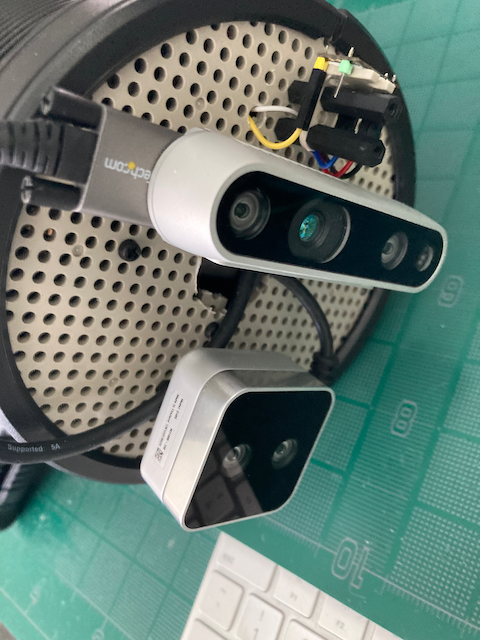
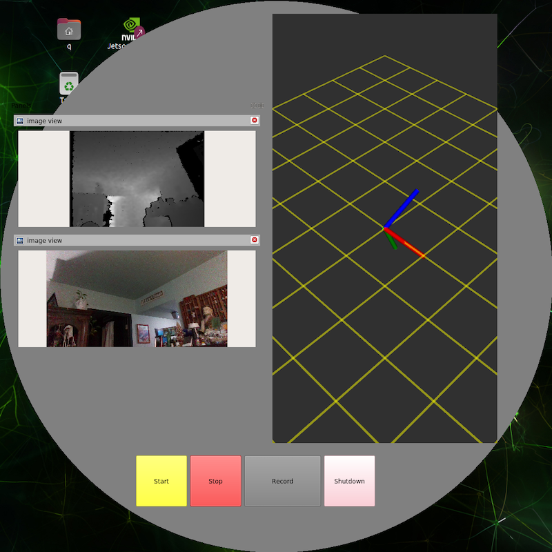
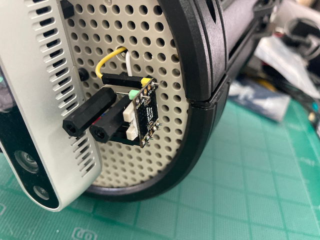
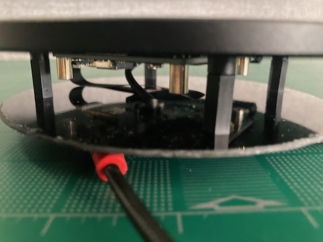
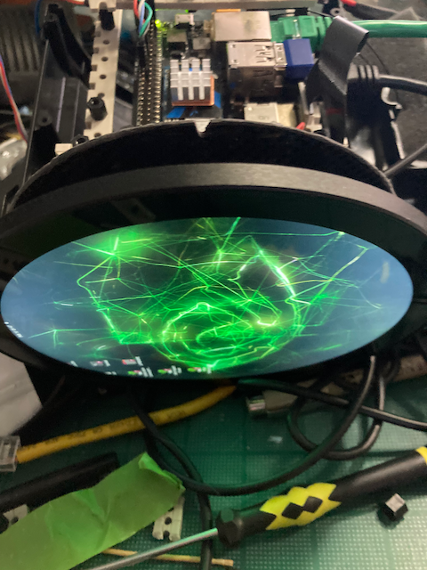
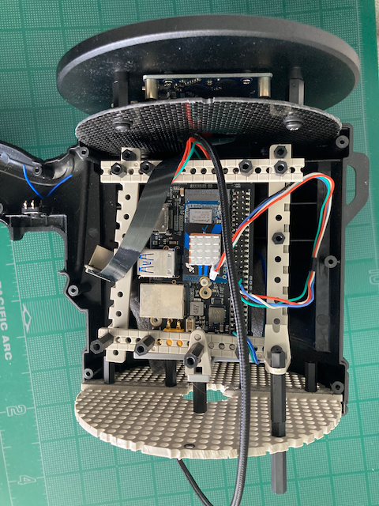
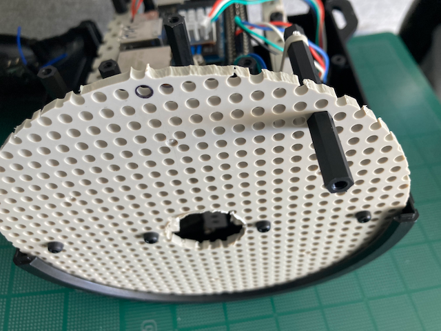
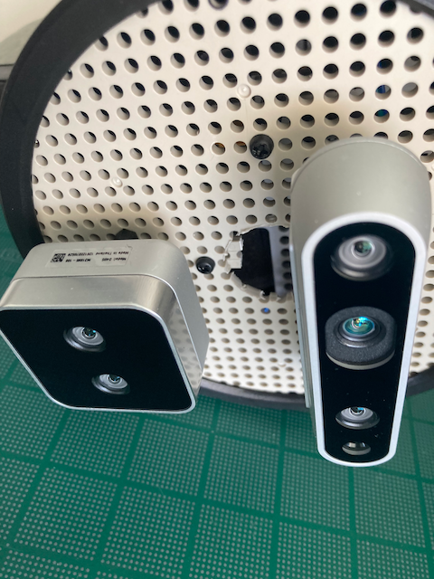
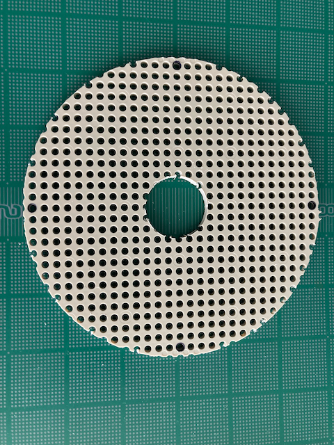
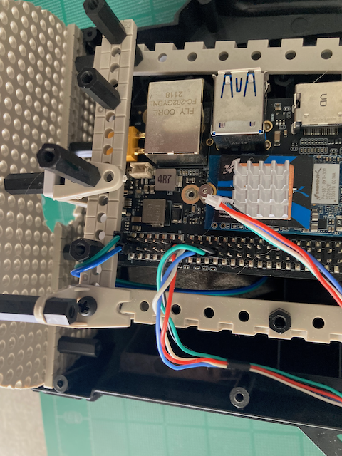

# Sort-of portable dual realsense camera pointcloud vacuum/testbed.
 </img>
 </img> 

## Motivation

I needed a somewhat mobile rig for pointcloud collection, and after exploring various solutions provided in walled
gardens... Decided to put one together, using open software and workflows. I decided to design around ros2, and since I had
a few realsense cameras already -- librealsense.

This is based around a [nVidia xavier nx (16GB) module](https://www.nvidia.com/en-us/autonomous-machines/embedded-systems/jetson-xavier-series/ 'xavier nx')

- The carrier board is a seeed studio [A203](https://www.seeedstudio.com/A203-Carrier-Board-for-Jetson-Nano-Xavier-NX-V2-p-5214.html 'Seeed A203')
- Cameras are Intel Realsense [D405](https://www.intelrealsense.com/depth-camera-d405/ 'realsense D405'), and [D415](https://www.intelrealsense.com/depth-camera-d415/ 'realsense D415')
- Display is a round 5" [Waveshare touchscreen](https://www.waveshare.com/5inch-1080x1080-lcd.htm 'waveshare') monitor.
- The front mounting disk is circle cut from [Tamiya universal plate](https://www.tamiyausa.com/shop/educational-construction/universal-plate/ 'Tamiya Plate')
- A teensy 4.1 is used to handle the off camera imu via micro ros -- see the companion project: https://github.com/weaponeer/teensyimu_usfsmax_uros
- The enclosure started life as a handheld led spotlight, why ? It just looked like it would work... https://www.amazon.com/gp/product/B09YM4QXGP

## Build

- Waveshare round display standoff mounted to fiber backplate, for my monitor mount holes were an odd 3.5mm size.
- Faceplate/camera grid plate is cut from Tamiya plate.  Carrier board "adapter" also built from Tamiya "rails". [The famous EPO (Houston) ](https://epohouston.com/ 'EPO') carries Tamiya
- Ribbom HDMI cable, various short usb-c cables and a compact usb-c [hub]( https://www.amazon.com/gp/product/B0BP81NSNZ '5port hub')
- The carrier module and PD for the cameras via the hub is external and long usb-c PD cables rounted through the handle.
- Various usb-c angle adapters are used, and one must be careful to check that connection speed is not degraded.  Always purchase good adapters. 

</img>
</img> 
</img> 
</img> 
</img> 
</img> 
</img>

</img> 
</img> 
</img> 
</img>
</img> 
</img> 
</img> 
</img> 
</img> 

## Platform setp

This is mostly a platform project, as that is where most of the time has been spent.  

- A203 with nvme 2TB, wifi optional. Xavier NX 16GB module.
- flashed with nVidia L4T linux -- # R35 (release), REVISION: 4.1
- development tools for below
- librealsense (and kernel patches)
- opencv with cuda
- docker -- remember to set up groups, nvidia runtime, etc.
- ros2
- ros2 imu_tools
- ros2 realsense-ros
- I also have the PlatformIO CLI installed to build the microros/teensy imu and upload -- without opening the case.

## Recording App

A simple control and viz app using rviz2 displays and panels in the c++.  There is also python app [camGui.py ](./src/camGui.py 'camGui') used for testing, 
but with no displays (yet).  I will loop back and perhaps add VTK+PCL display, but the c++ reuse of rviz2 and handling of TF Frames, etc., complicate this decision.

Both apps use QProcess to launch ros2 flows for the cameras, docker process for th uRos (microros) bridge, and recording (ros2 bag) process.  The python app uses docker python api to handle the uRos bridge, as it was available.

- C++ app in [src ](./src 'src') grew from this -- https://github.com/mjeronimo/rviz_embed_test
- inside the ros2 environment (souce setuo.sh...) -- colcon build, etc.
- The QWindows of both apps try to accommodate the round Waveshare display, and will look odd but work on other displays.  One can just remove the overload of paintEvent, 
but remember QT always suprises... 

## todo

- TF setup and URDF for camera -- shortly.
- Better recording logic, working on this now.
- add camera selection, perhaps switch based on min/max depth
- better undertand rviz2 display issues, not updating, etc.
- valgrind and tidy up. 

